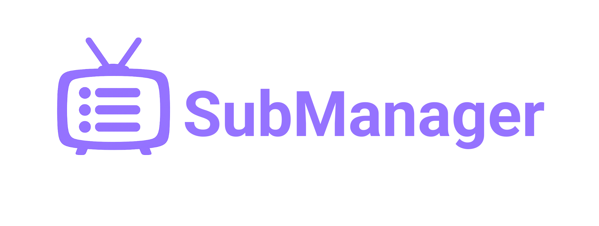

<p align="center">
  
</p>

SubManager is a self-hosted application for managing YouTube subscriptions and keeping up with new videos without relying on YouTube's subscription feed.

## Screenshots

<p align="center">
  
  
</p>
<p align="center">
  
</p>

## Features

* Add and categorize YouTube channel subscriptions
* Import subscriptions from YouTube, NewPipe, and more
* Retrieve new videos from subscribed channels
* Search and filter channels and videos
* Track watched videos
* Switch between dark and light themes
* Install on desktop or mobile as a PWA

## Installation


### Docker Install (Recommended)

#### Requirements
* Docker Desktop, or Docker Engine with the Docker Compose plugin
* (Optional) An SMTP account for password reset emails

#### 1. Download the deployment files

Download and extract [submanager-docker.zip](https://github.com/irixos/submanager/releases/latest/download/submanager-docker.zip).

#### 2. Create the environment file

Copy `.env.example` to `.env`.

```bash
cp .env.example .env
```

Open `.env` and configure the required values.

Set a strong SQL Server password:

```ini
SQLSERVER_SA_PASSWORD=ChangeThis_Example123!
```

#### 3. (Optional) Configure email delivery
SubManager uses SMTP for password-reset emails.

Example Gmail configuration:
```ini
SUBMANAGER_SMTP_HOST=smtp.gmail.com
SUBMANAGER_SMTP_USERNAME=youraccount@gmail.com
SUBMANAGER_SMTP_PASSWORD=your-app-password
SUBMANAGER_SMTP_PORT=587
SUBMANAGER_SMTP_FROM_ADDRESS=youraccount@gmail.com
```

Make sure to use an app password rather than your normal account password when required by your email provider (e.g. for Gmail).

#### 4. (Optional) Configure Caddy reverse proxy for HTTPS
Note: this step is only required for HTTPS support (e.g. when hosting publicly).

Uncomment the following line in `.env` and replace with your domain:

```ini
SUBMANAGER_DOMAIN=submanager.example.com
```

In `compose.yaml`, remove or comment out the direct port mapping:

```yaml
# ports:
#   - "${SUBMANAGER_PORT:-8080}:8080"
```

Uncomment the following line:

```yaml
ASPNETCORE_FORWARDEDHEADERS_ENABLED: "true"
```

Uncomment the caddy section:

```yaml
caddy:
  image: caddy:2-alpine
  command: ["caddy", "reverse-proxy", "--from", "${SUBMANAGER_DOMAIN:?Set SUBMANAGER_DOMAIN in .env}", "--to", "submanager:8080"]
  ports:
    - "80:80"
    - "443:443"
  volumes:
    - caddy-data:/data
  depends_on:
    submanager:
      condition: service_started
  restart: unless-stopped
```

and uncomment the `caddy-data` volume:

```yaml
volumes:
  sqlserver-data:
  caddy-data:
```

Caddy will automatically obtain and renew the HTTPS certificate. The server must remain publicly reachable on ports 80 and 443 for normal certificate issuance and renewal.

#### 5. Start SubManager

Start the Docker container with:

```bash
docker compose up -d
```

If locally hosting without Caddy enabled, SubManager will be available at:

```
http://localhost:8080
```

Otherwise, navigate to your configured domain.

### Updating a release installation
To update, run:
```bash
docker compose pull
docker compose up -d
```

### Build Docker image from source

If you'd rather build the Docker image from source, clone the repo:

```bash
git clone https://github.com/irixos/submanager.git
cd submanager
```

Copy `.env.example` to `.env`, configure it, then build/start the container with:
```bash
docker compose -f compose.yaml -f compose.build.yaml up --build
```

## License

[MIT](./LICENSE)